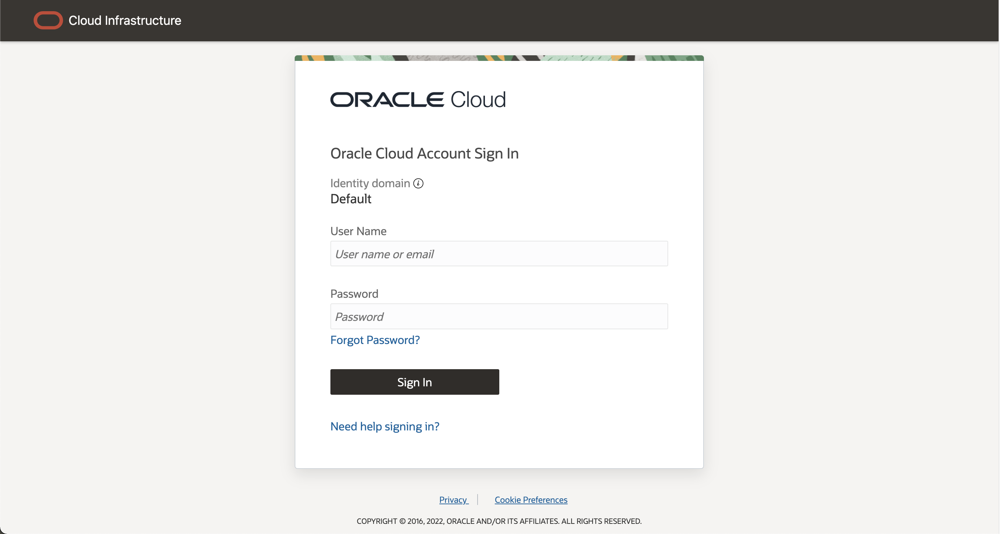
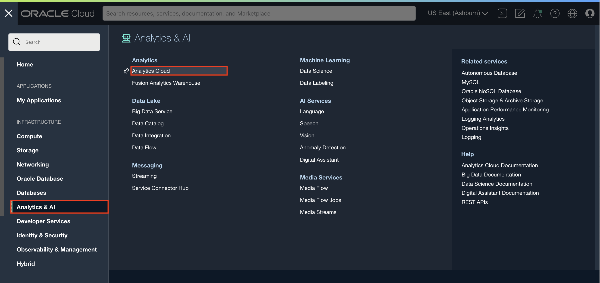
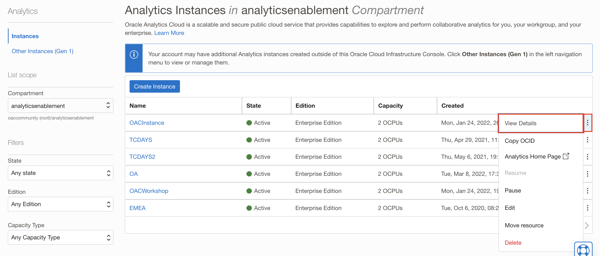
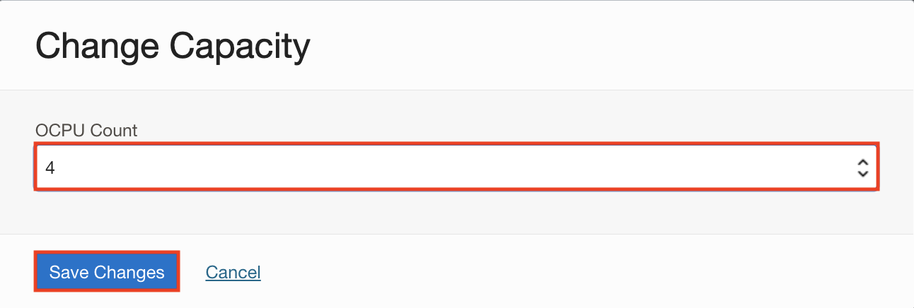

## How do I increase the processing capacity of my Oracle Analytics (OAC) instance?

Duration: 1 minute

When working with Oracle Analytics Cloud, you can leverage the platform's scalability. For this, you will need access to the Oracle Cloud Infrastructure Console.

The OCI Console is where you can accomplish most administrative tasks for OAC. You can access services and update instance details using the Console, API, or command line. In this document, we'll be using the OCI Console.

### View or Update OAC Processing Capacity using the Console
>**Note:** You must have access to the OCI Console to successfully complete this Sprint.

1. Sign in to your Oracle Cloud account.

  

2. In the Oracle Cloud Infrastructure Console, click the  icon in the top left corner.

3. In the menu, click **Analytics & AI**. Under **Analytics**, click **Analytics Cloud**.

  

4. Select the compartment that contains the Oracle Analytics Cloud instance you're looking for. Click the  icon of the instance you want to increase the processing capacity for and select **View Details**.

  

5. Click **Change Capacity**.

  

6. From here, you can view and change the number of OCPUs being used to scale up your Oracle Analytics Cloud instance. Scale up or down by click the drop down option and select the OCPU Count. Then click **Save**.

  

Congratulations! You have just learned how to increase the processing capacity of your Oracle Analytics Cloud instance!

## Learn More
* [OAC Administer Documentation](https://docs.oracle.com/en/cloud/paas/analytics-cloud/acoci/administer-services.html#GUID-51F53680-13E0-45B7-AD95-B2091F8AB442)
* [About Scaling](https://docs.oracle.com/en/cloud/paas/analytics-cloud/acoci/administer-services.html#GUID-3483FDF5-A596-4B61-8E8E-A28D9450FF7E)

## Acknowledgements
* **Author:** Runit Malik, Solution Engineer
* **Contributor:** Nagwang Gyamtso, Product Manager, Product Strategy
* **Last Updated By/Date:** Runit Malik, October 2022
