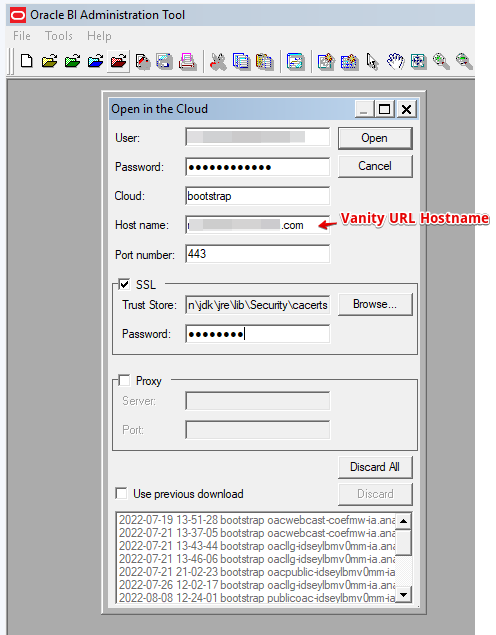
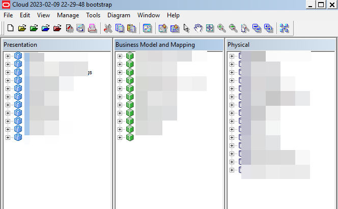

# How do I open Oracle Analytics Cloud RPD with Vanity URL Hostname?

Duration: 2 minutes

A vanity URL is a unique, customized web address that's branded for marketing purposes and helps users remember and find your web site. If you want to customize the user login experience for Oracle Analytics Cloud, you can use your own vanity URL instead of the default URL that Oracle provides.

In this Sprint, we will discuss the steps to be followed to open the RPD in cloud with the Vanity URL host name.

## Provision a FAW instance

>**Note:** You must have be an IDCS Native user to complete this Sprint.

1. Open **Oracle BI Administration Tool** (RPD) and select **Open in the Cloud** option.

  Select **File**, **Open**, **In the Cloud** or click on the **Red Folder** icon from the options as shown in screenshot.

  Use IDCS Native user, password, vanity URL hostname and the Trust store password and click **Open**.

  

2. By default when you try to open a RPD with Vanity URL hostname, you get **SSLHandshakeException**: error as shown in screenshot below.

  

3. To resolve this error, Import the Vanity URL root and Intermediate CA Certificates into Client tool JDK KeyStore.

  Navigate to the Admin tool Trust Store path
  Ex: <code>C:\Oracle\Middleware\OAC6.7_Client\oracle_common\jdk\jre\lib\Security\cacerts</code>

  Open Command Prompt as Administrator, set JAVA HOME path, import Intermediate and Root certs into JDK KeyStore

  <code>C:\Oracle\Middleware\OAC6.7_Client\oracle_common\jdk\jre\lib\security>set JAVA_HOME=C:\Oracle\Middleware\OAC6.7_Client\oracle_common\jdk</code>

  <code>C:\Oracle\Middleware\OAC6.7_Client\oracle_common\jdk\jre\lib\security>set PATH=%JAVA_HOME%\bin;%PATH%</code>

  <code>keytool -import -trustcacerts -alias oacinter -file C:\VanitySSL\interCA.cer -keypass Oracle123 -keystore cacerts -storepass changeit</code>

  <code>keytool -import -trustcacerts -alias vanityroot -file C:\VanitySSL\rootCA.cer -keypass Oracle123 -keystore cacerts -storepass changeit</code>

  

4. Test again and you will notice that you can now open the RPD with Vanity URL hostname successfully.

  

## Acknowledgements
* **Author** - Ravi Bhuma, CEAL
* **Last Updated By/Date** - Nagwang Gyamtso,  April 2023
